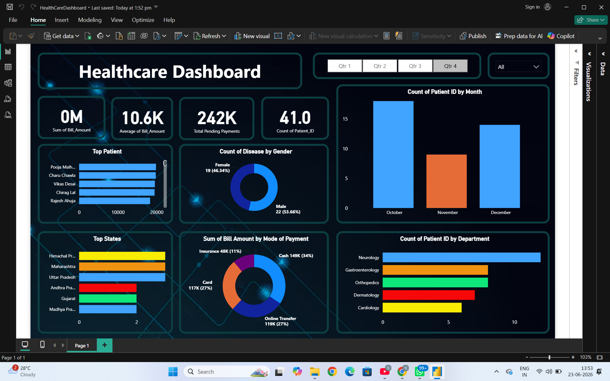

# 🏥 Healthcare Analytics Dashboard (Power BI)

An interactive Healthcare Analytics Dashboard built in **Power BI** to analyze patient records, billing, payment methods, disease distribution, and department-wise performance. The dashboard enables data-driven insights for hospital administrators and healthcare analysts through dynamic KPIs, charts, and slicers.

---

## 📌 Overview

This project transforms raw healthcare data (patient records, billing, and department info) into a single-page interactive Power BI report. It highlights key metrics such as total billing, pending payments, patient counts, and trends — helping stakeholders quickly assess hospital performance and patient demographics.

---

## ✨ Features

- **KPI Cards** — Sum of Bill Amount, Average Bill Amount, Total Pending Payments, and Count of Patient ID
- **Count of Patient ID by Month** — Monthly patient registration trend (bar chart)
- **Top Patient** — Ranked view of patients by billing amount
- **Count of Disease by Gender** — Donut chart comparing disease distribution across Male/Female patients
- **Top States** — Patient distribution by state
- **Sum of Bill Amount by Mode of Payment** — Donut chart across Insurance, Card, Cash, and Online Transfer
- **Count of Patient ID by Department** — Department-wise patient load (Neurology, Gastroenterology, Orthopedics, Dermatology, Cardiology)
- **Quarterly Slicer (Qtr 1–Qtr 4)** and **category filter** for dynamic, interactive filtering across all visuals

---

## 🧰 Tools & Technologies

- **Power BI Desktop** — Report building & visualization
- **Power Query** — Data cleaning and transformation
- **DAX** — Calculated measures and KPIs
- **Excel/CSV** — Source data format

---

## 🔍 Key Insights

- **Neurology** recorded the highest patient count among all departments.
- **Online Transfer** (27%) and **Cash** (34%) were the most preferred payment methods.
- **October** had the highest patient registrations, followed by December.
- Disease distribution is fairly balanced by gender (Female 46.3% / Male 53.7%).
- Interactive quarterly and category filters allow drill-down into specific time periods and segments.

---

## 📂 Repository Contents

| File | Description |
|---|---|
| `HealthCareDashboard.pbix` | Power BI report file (open in Power BI Desktop) |
| `dashboard.png` | Dashboard screenshot/preview |
| `README.md` | Project documentation |

---

## 🚀 How to Use

1. Clone or download this repository.
2. Open `HealthCareDashboard.pbix` in **Power BI Desktop** (free download from [Microsoft](https://powerbi.microsoft.com/desktop/)).
3. Use the **Qtr 1–Qtr 4** slicer and dropdown filter at the top to explore data by time period and category.
4. Hover over any visual for detailed tooltips.

---

## 🎯 Skills Demonstrated

- Data Cleaning & Transformation
- Data Modeling
- DAX Calculations
- Interactive Dashboard Design
- Business Intelligence Reporting

---

## 📬 Contact

Feel free to connect if you have feedback or questions about this project.
